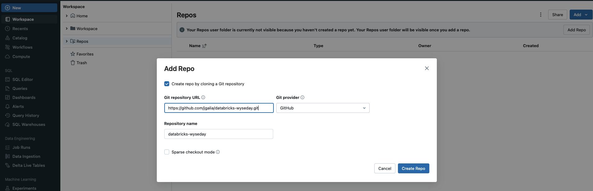

# Pre-requisites

## Connect to databricks platform

Give you email to your admin and you will receive 2 mails
* The first to set your password
* The second to access databricks platform

## Create and add a GitHub token to databricks

* create a Github token for your wewyse account gitHub:
* go to the [databricks documentation](https://docs.databricks.com/repos/get-access-tokens-from-git-provider.html).
* Follow  the paragraph "Connect to a GitHub repo using a personal access token"

## Pull the repo in databricks

* Click on "Workspace > Repos >
* Then click on "Add > Repo". Add the GitHub repository: https://github.com/dktunited/dps-spark-training-course
  

* Check that you can execute the first cell of the notebook
