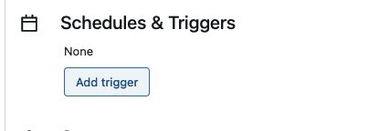

# create workflow
documentation : https://docs.databricks.com/en/workflows/jobs/create-run-jobs.html#create-a-job

* change the path at the end of the notebook workflow-job

* click on workflows > create job

* choose type : notebook

* select notebook, choose workflow-job that you have updated with your initials

* then click on "run now"

* monitore the run

# schedule workflow
documentation : https://docs.databricks.com/en/notebooks/schedule-notebook-jobs.html#schedule-a-notebook-job

* click on add trigger

* choose scheduled

* active and save

* you can pause the trigger

