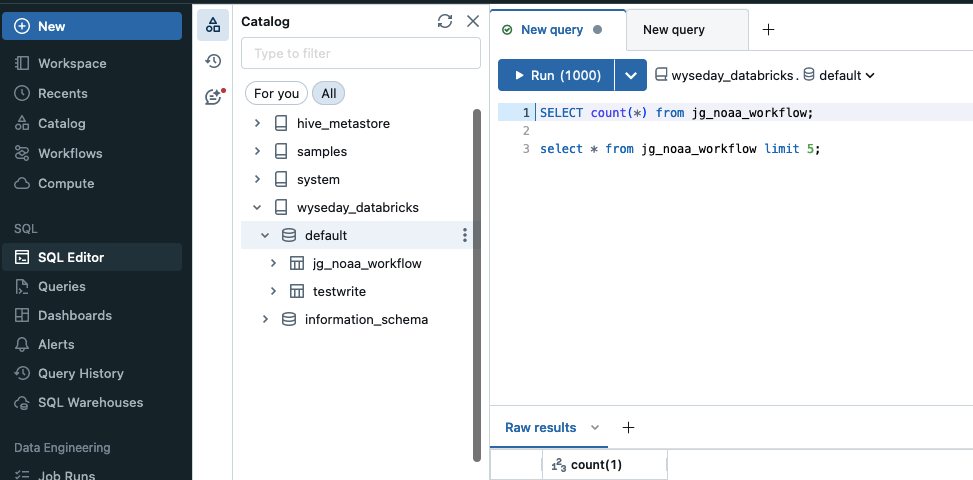
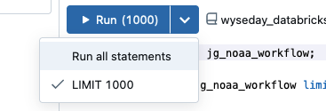
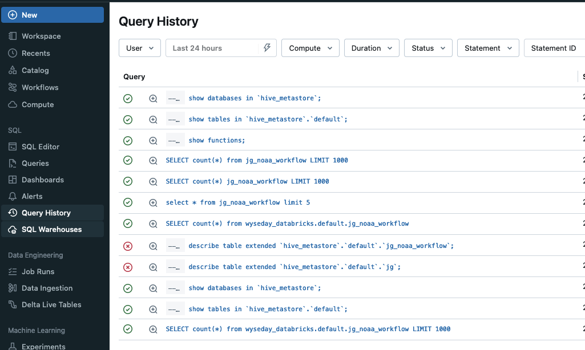
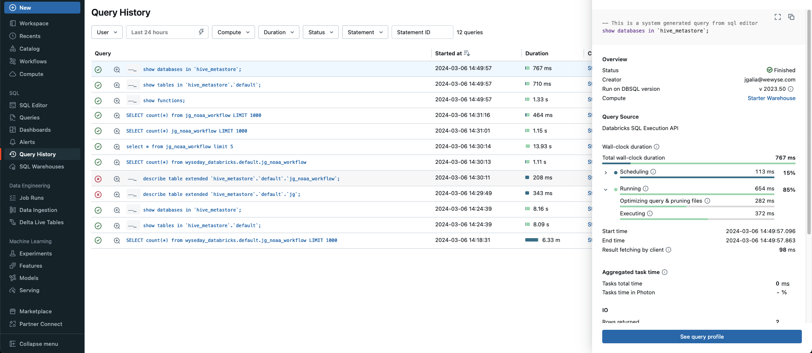

# SQL editor

* click on sql editor > new query

* you can explorer the catalog

* you can write several requests in a query file (don't forget the ;).

* In the run box you can check/uncheck "all statements" and "limit 100". Uncheck all statements to run only the request where is your cursor.
  

* what is the total count of rows of your XX_noaa_workflow table ?

* 

# Query history
* Go in query history, search your last query

  

*  click on your request, then on "see your query profile"

