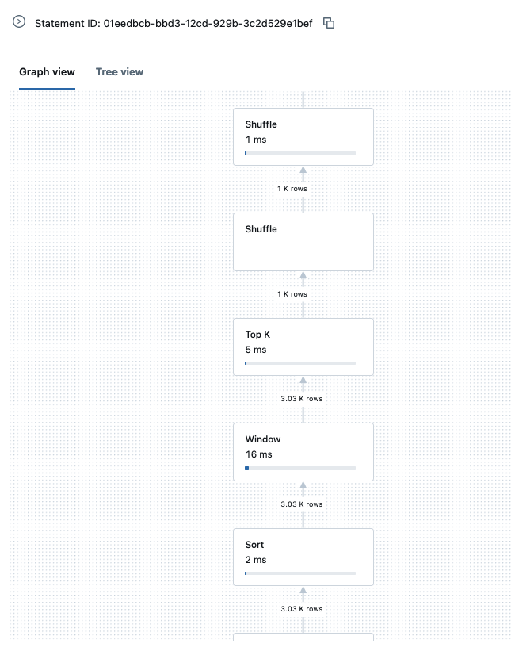

# SQL editor
## discover

* click on sql editor > new query

* you can explorer the catalog

* you can write several requests in a query file (don't forget the ;).

* In the run box you can check/uncheck "all statements" and "limit 100". Uncheck all statements to run only the request where is your cursor.
  

## exercices : 1 candy by good answer (without cheating)
* what is the total count of rows of your XX_noaa_workflow table ?

* how many stations are there ? 

* how many stations in paris ? 

### window

* what is the cumulative sum of PRCP (precipitation) in PARIS since the start of the data for the 2024-02-01 ? (don't use filter) 

* what is the total sum of precipitation in Paris in february 2024 ? 69,4

* More or less than 2023 ? 2024 > 2023

# Query history
* Go in query history, search your last query

  

*  click on your request

* then on "see your query profile"

