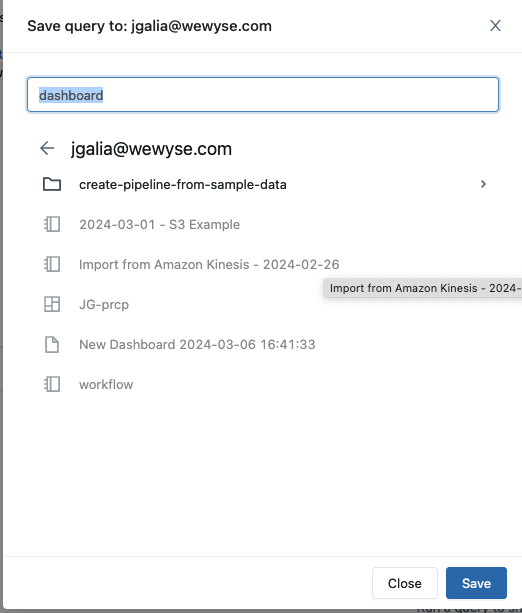
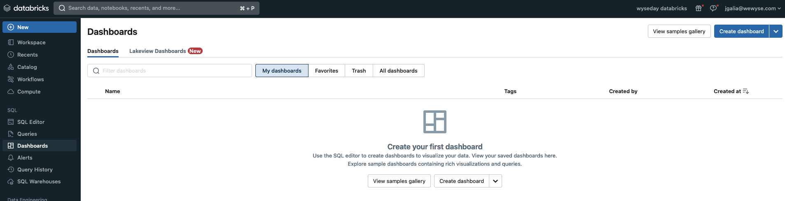
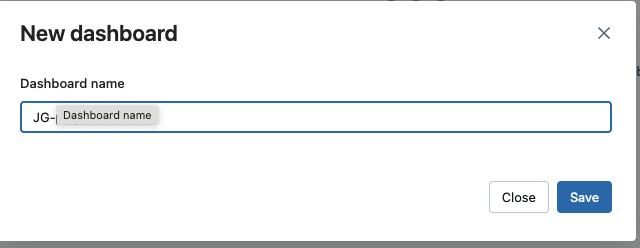
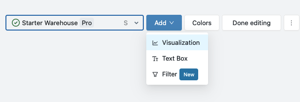
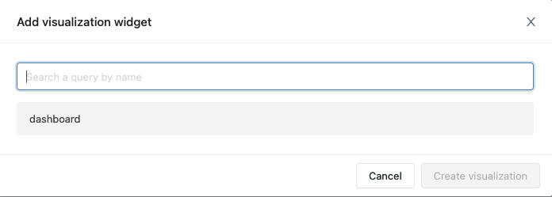
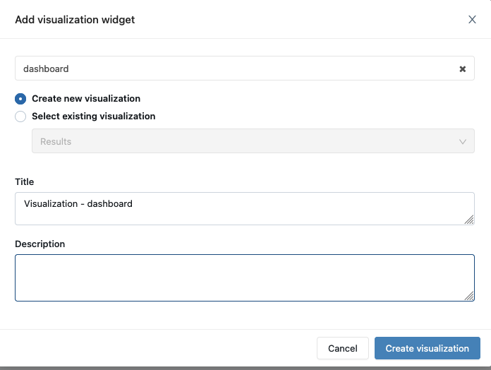
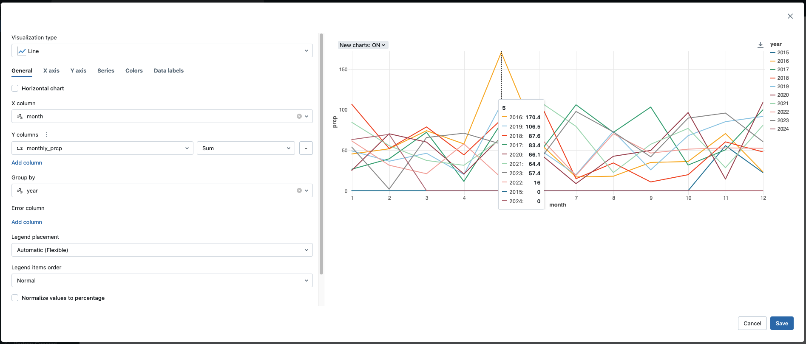
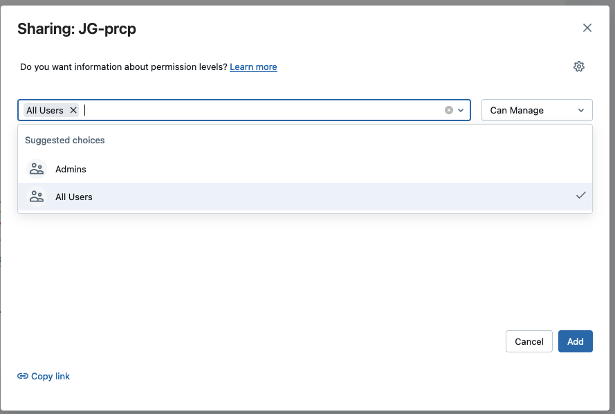
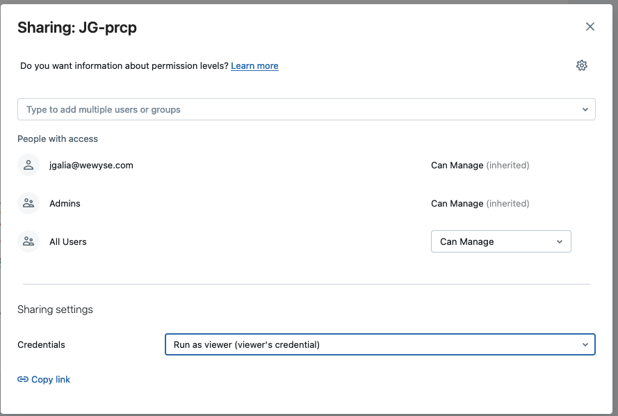

# create a query
* In sql editer create a new query and save it:

```
select sum (PRCP) as monthly_prcp, month(DATE) as month, year(DATE) as year
from wyseday_databricks.default.jg_noaa_workflow where NAME like '%PARIS%'  group by month(DATE), year(DATE) order by year, month ;
```




# create a dashboard
* go in the dashboard menu



* click on create a dashboard



* click on add visualization



* choose the query you have saved



* select "create new visualization" and click on "create visualization"



* make your graph as you wish, exemple : perso_vis



* save and share you dashboard



* choose the credentials to share




